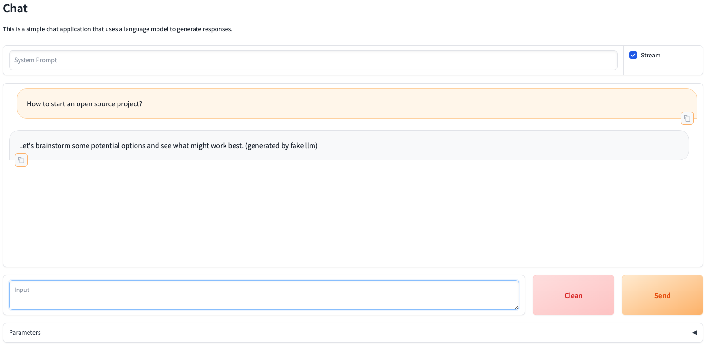

# chatfactory

Chatfactory provides an easy way to build chat applications with LLMs, offering templates, interfaces, and support for multiple llm backends.

## Features

- Template-driven application creation for non-coders, enabling app development with just one command.
- Simplified API interface for developers, eliminating complex development workflows.
- Integration with multiple LLM backends, including OpenAI and Hugging Face.

## Installation

1. Clone the repository:

    ```bash
    git clone https://github.com/zhangsibo1129/chatfactory.git
    ```

2. Install the required dependencies:

    ```bash
    cd chatfactory
    pip install -r requirements.txt
    ```

## Quickstart

You can quickly start a chat application with the following one-line command, without local GPU or remote API resources.

1. launch the chat application:

    ```bash
    python src/chatfactory/app/simple_chat.py --llm-engine fake --port 7860
    ```

2. Open your browser and visit `http://localhost:7860` to interact with the chat application.

    

## How to use

### Launch a template application

- launch a chat application with openai backend:

    ```bash
    export OPENAI_API_KEY="openai_api_key"
    export OPENAI_BASE_URL="openai_base_url"
    python src/chatfactory/app/simple_chat.py --llm-engine openai
    ```

    or

    ```bash
    python src/chatfactory/app/simple_chat.py \
        --llm-engine openai \
        --llm-model gpt-3.5-turbo \
        --llm-model-config '{"api_key":"openai_api_key","base_url":"openai_base_url"}'
    ```

- launch a chat application with huggingface backend:

    ```bash
    python src/chatfactory/app/simple_chat.py \
        --llm-engine huggingface \
        --llm-model 01-ai/Yi-1.5-6B-Chat \
        --llm-model-config '{"torch_dtype":"auto","device_map":"auto"}'
    ```

### Customize application with bot moudle

## Contributing

As this project is in its early stages, all kinds of contributions are welcome, whether it's reporting issues, suggesting new features, or submitting pull requests.

## License

This project is licensed under the MIT License.
