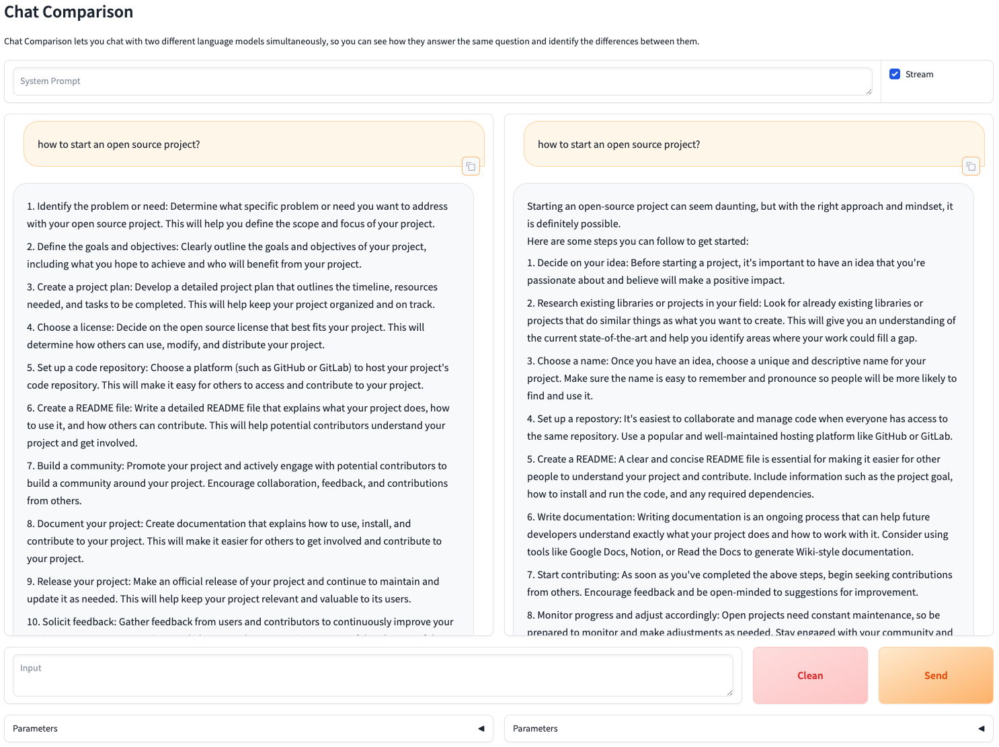

# Chat Comparison

Chat with 2 LLMs simultaneously and compare their results

## Interface



## Command

General Form

```bash
chatways comparison [options]
```

- **Case 1** Use Default Parameters

```bash
chatways comparison
```

- **Case 2** Config with Full Parameters

```bash
chatways comparison \
    --llm-engine1 openai \
    --llm-model1 gpt-3.5-turbo \
    --llm-model-config1 '{"api_key":"openai_api_key","base_url":"openai_base_url"}'
    --llm-engine2 huggingface \
    --llm-model2 Qwen/Qwen1.5-4B-Chat \
    --llm-model-config2 '{"torch_dtype":"auto","device_map":"auto"}'
```

- **Case 3** Set Partial Parameters with Abbreviations

```bash
chatways comparison \
    --le1 openai \
    --le2 huggingface \
    --lc2 '{"torch_dtype":"auto","device_map":"auto"}'
```

## Configuration

- **Address**
  - **Full Name**: `--address`
  - **Abbreviation**: `-a`
  - **Default Value**: `"127.0.0.1"`
  - **Description**: Address to which the application binds

- **Port**
  - **Full Name**: `--port`
  - **Abbreviation**: `-p`
  - **Default Value**: `7860`
  - **Description**: Port number to which the application binds

- **LLM Engine 1**
  - **Full Name**: `--llm-engine1`
  - **Abbreviation**: `-le1`
  - **Default Value**: `None`
  - **Description**: The first LLM engine

- **LLM Model 1**
  - **Full Name**: `--llm-model1`
  - **Abbreviation**: `-lm1`
  - **Default Value**: `None`
  - **Description**: The first LLM model path or name

- **LLM Model Config 1**
  - **Full Name**: `--llm-model-config1`
  - **Abbreviation**: `-lc1`
  - **Default Value**: `None`
  - **Description**: The first JSON configuration for the LLM

- **LLM Engine 2**
  - **Full Name**: `--llm-engine2`
  - **Abbreviation**: `-le2`
  - **Default Value**: `None`
  - **Description**: The second LLM engine

- **LLM Model 2**
  - **Full Name**: `--llm-model2`
  - **Abbreviation**: `-lm2`
  - **Default Value**: `None`
  - **Description**: The second LLM model path or name

- **LLM Model Config 2**
  - **Full Name**: `--llm-model-config2`
  - **Abbreviation**: `-lc2`
  - **Default Value**: `None`
  - **Description**: The second JSON configuration for the LLM
